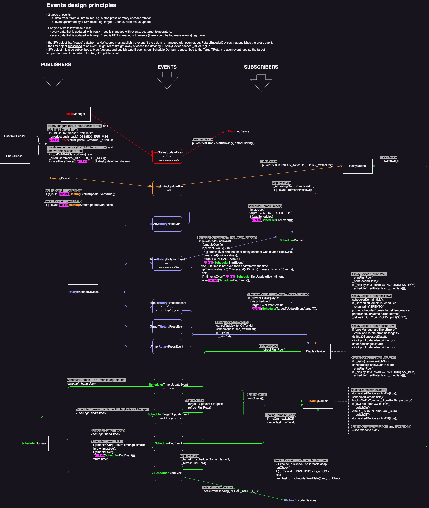

# **TSTAT**

A cronothermostat based on Arduino.  
With:

- 2 rotary encoders to control the target temperature and the countdown timer;
- 16x2 display
- 3 LEDs to indicate:
  - a running check on temperature and timer
  - error state
  - the status of the heating (ON/OFF)
- a relay to actually switch ON/OFF the boiler and pumps.

# Architecture

The software architecture is based on events.

# Hardware specs

TODO

# Circuit

TODO

# Copyright

Copyright puntonim (https://github.com/puntonim). No License.
